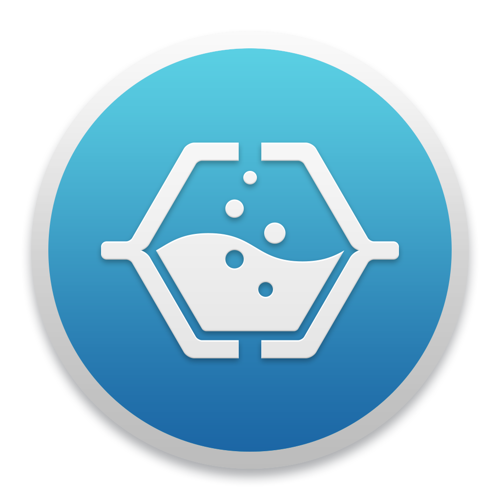

# MDStudio

MDStudio is a stand-alone framework to build distributed applications using a broker-based ([Crossbar](https://crossbar.io)) microservice concept.
The only requirement for any piece of software or script to become a microservice is a formal definition of the functional endpoints that expose
the functionality the software has to offer. In MDStudio, this definition is a very thin layer available in nearly 12 different [languages](https://crossbar.io/about/Supported-Languages/)
in which communication is network based using JSON and the input/output of the endpoints is fully described using JSON schemas.

## Installation

To make development and deployment easier we have setup a docker environment hosting the microservice broker and support microservices in a self
consistent environment.

### Quick-start docker based installation

The only requirement MDStudio has is [Docker](https://www.docker.com/).
Next, run the builder and start the microservice docker environment under bash as:

	Clone the repository using the devel branch
	>> git clone -b devel git@github.com:MD-Studio/MDStudio.git
	Install the dependencies from the MDStudio folder
	>> pip install -r requirements-dev.txt
	Install mdstudio
	>> pip install -e mdstudio
    >> ./build.sh
    >> ./standalone.sh

The docker containers only need to be build once and for subsequent usage running
standalone.sh is sufficient.

### Manual (non-docker) based installation

The docker based environment is the most convenient way for developing microservices and deploying distributed applications.
If you are unable to use Docker or want to keep track of the whole environment for yourself, you should follow these installation
instructions.

The MDStudio application is written in Python and mostly self contained thanks to the use of an in-application Python virtual environment.
The application has currently been successfully tested with Python versions: 2.7

The only external dependencies are:

 * [MongoDB](https://www.mongodb.com) - A NoSQL database.
 * [Pipenv](https://github.com/kennethreitz/pipenv) - A python virtual environment manager.
 * [Redis](https://redis.io/) - A fast caching layer.

Install the virtual environment with:

    >> pipenv install --skip-lock --dev

The application is started on the command line as:

    >> pipenv shell
    >> python .

#### PyCharm IDE Integration
Go to `File > Project Settings > Project Interpreter`, and add a remote interpreter,
and make sure it matches this screen.

Note specifically:

|                      |                                                            |
|----------------------|------------------------------------------------------------|
| Interpreter path     | `/root/mdstudio/app-4PlAip0Q/bin/python`   |

## Creating microservices

Now that you have successfully installed the MDStudio framework you can start having fun by writing some
microservices and using their endpoints in any number of different ways as briefly described in the intro.

For guidance and inspiration on how to write and use microservices, please have a look at the [MDStudio examples](https://github.com/MD-Studio/MDStudio_examples)
repository on GitHub.
