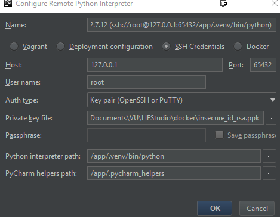
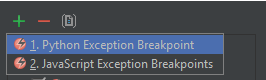
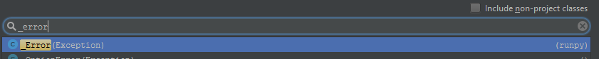
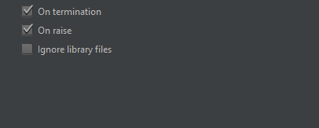

.. _get-started:

Get Started
===========

Docker
------
To make development easier we have setup a docker environment.

Prerequisites
~~~~~~~~~~~~~

 * Docker_, that's it.

Installation
~~~~~~~~~~~~
Run the builder under bash:

.. code-block:: bash

    $ ./build.sh

Usage
~~~~~
To use the docker environment you have to start the container:

.. code-block:: bash

    $ ./start.sh

This command will spin up the complete environment including MongoDB, and ssh's into the 
container. When you want to exit this mode just use `>> exit` to exit. Containers can be
stopped using:

.. code-block:: bash

    $ ./stop.sh

SSH Access
~~~~~~~~~~
When you want to use your private shell you can login using ssh using the following setttings:

+--------+----------------------------------+
| Host   | ``127.0.0.1``                    |
+--------+----------------------------------+
| Key    | ``docker/insecure_id_rsa.ppk``   |
+--------+----------------------------------+
| User   | ``root``                         |
+--------+----------------------------------+
| Port   | ``65432``                        |
+--------+----------------------------------+

.. warning::

    On Windows it could be that the working directory is empty. Please use ``cd /app`` to go to the correct directory!

IDE Integration
~~~~~~~~~~~~~~~

Pycharms
~~~~~~~~~~~~~

Go to `File > Project Settings > Project Interpreter`, and add a remote interpreter,
and make sure it matches this screen.

Note specifically:

+--------------------+--------------------------------+
| Interpreter path   | ``/app/lie_venv/bin/python``   |
+--------------------+--------------------------------+
| Pycharm helpers    | ``/app/.pycharm_helpers``      |
+--------------------+--------------------------------+

Debug Hook
~~~~~~~~~~~~~
While we now support breakpoints and the likes natively, Pycharm still fails to do post morten
debugging in components. Fixing this is easy; We go to `Run > View Breakpoints`. We add a 
python exception breakpoint. 

After that we select the runpy._error exception:

Make sure `On Raise` is selected:

Manual
------

When you want to keep track of the whole environment for yourself, you should follow these
instructions.

Prerequisites
~~~~~~~~~~~~~
The LIEStudio application is written in Python and mostly self contained thanks to the
use of an in-application Python virtual environment.
The application has currently been successfully tested with Python versions: 2.7

The only external dependency is the [MongoDB](https://www.mongodb.com) NoSQL database
making available the `mongod` MongoDB exacutable in the users path.

Installation
~~~~~~~~~~~~
Run the `installer.sh` script as:

.. code-block:: bash

    $ ./installer.sh -s

for a quick install using the default Python version. Use -h for more information on
customizing the installation.

A quick install will in sequence:

* Setup a python virtual environment
* Download the latest Crossbar release from GitHub using wget. This is required as the
  LIEStudio application uses features in Crossbar that are not available in version
  0.15.0 from the Python package repository.
* Install required packages from the Python package repository.
* Install LIEStudio component Python packages and there dependencies
* Create a self-signed certificate for WAMP communication over TLS secured websockets.
  Certificate creation requires OpenSSL. If not available the default certificate
  shipped with the package will be used (liestudio/data/crossbar).
  It is recommended to replace the certificate with a personal one signed by a offical
  certificate authority when using the application in a production environment.
* Compile API documentation available from the browser when the program is running at
  http://localhost/help.
  
Usage
~~~~~
The application is started on the command line as:

.. code-block:: bash

    $ source ./lie_venv/bin/activate
    $ python .

.. _Docker: https://www.docker.com/